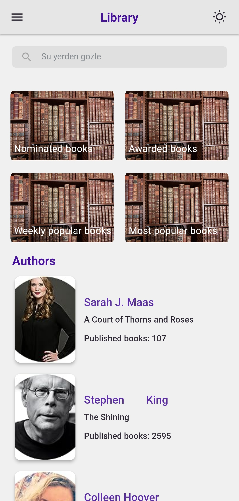
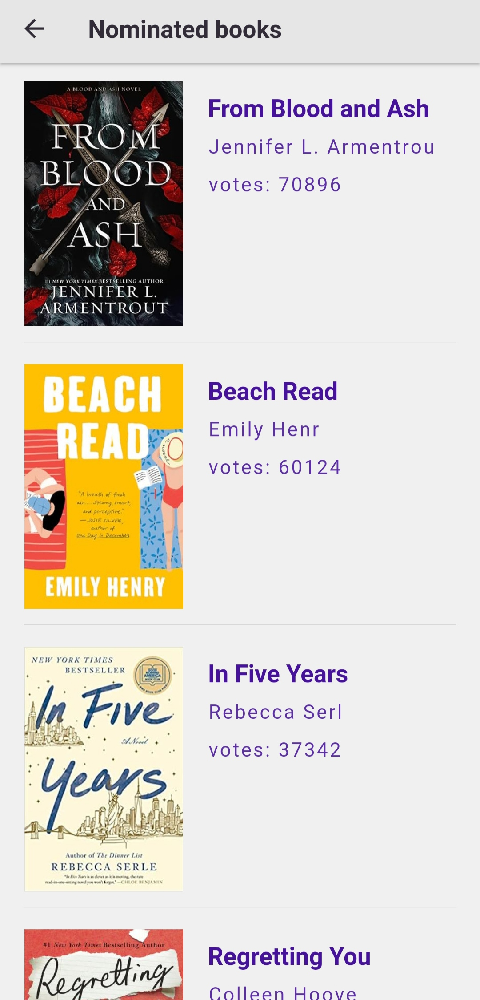
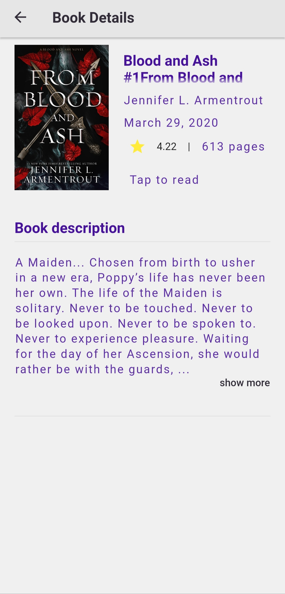
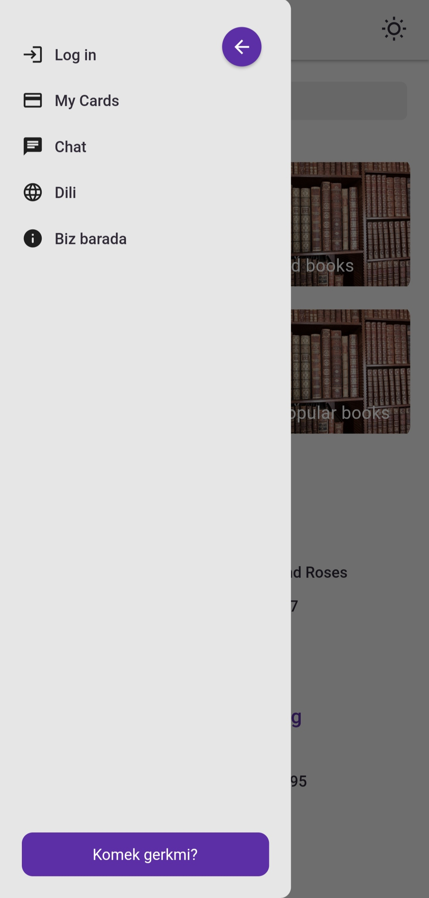
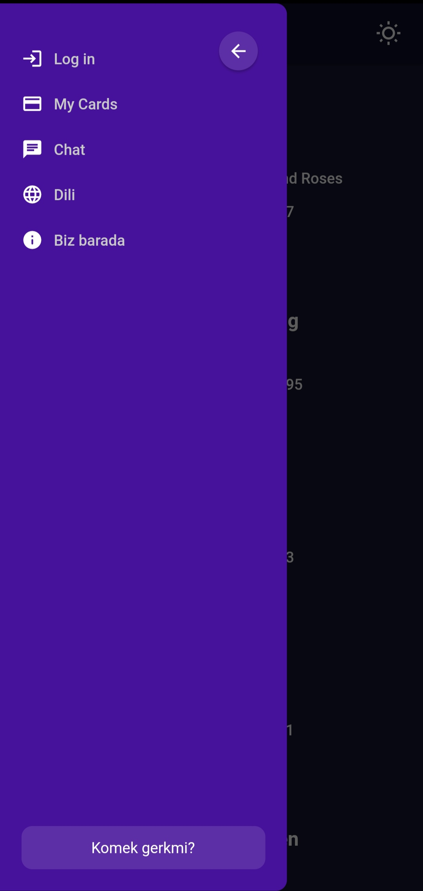
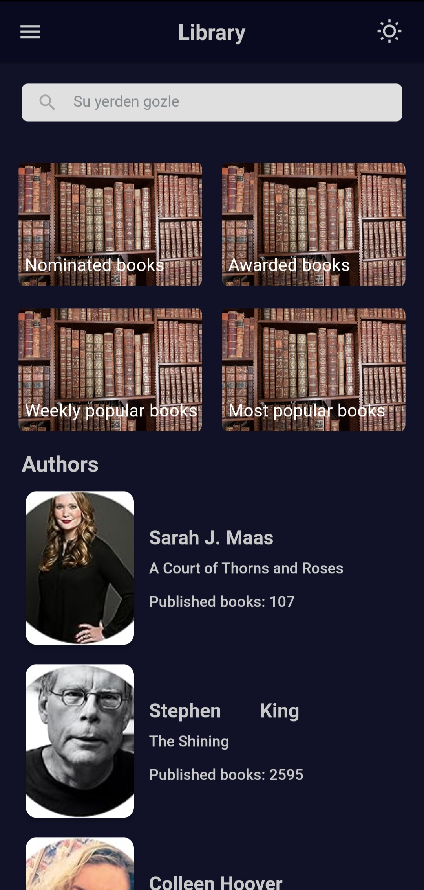
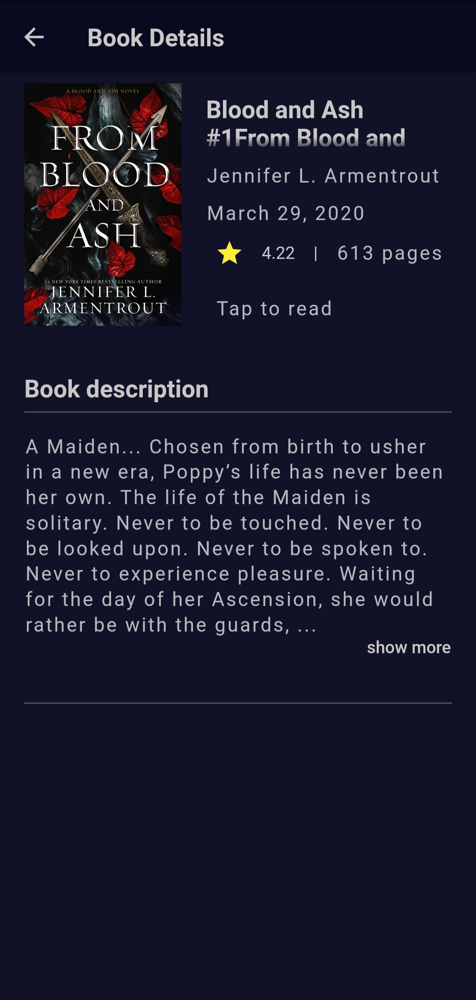

# Electron books

 - Flutter Clean architecture
 - Bloc state management
 - DI get_it
 - Routing: auto_route package
 - Floor database
 - http package used to fetch remote data
 - Dark and Light theme

# Test  
  - Widget testing
  - Unit testing
  - Integration testing

## Screenshots:

<table>
  <tr>
    <td></td>
    <td></td>
  </tr>
  <tr>
    <td></td>
    <td></td>
  </tr>
  <tr>
    <td></td>
    <td></td>
  </tr>
  <tr>
    <td></td>
    <td></td>
  </tr>
  <tr>
    <td></td>
    <td></td>
  </tr>
</table>
